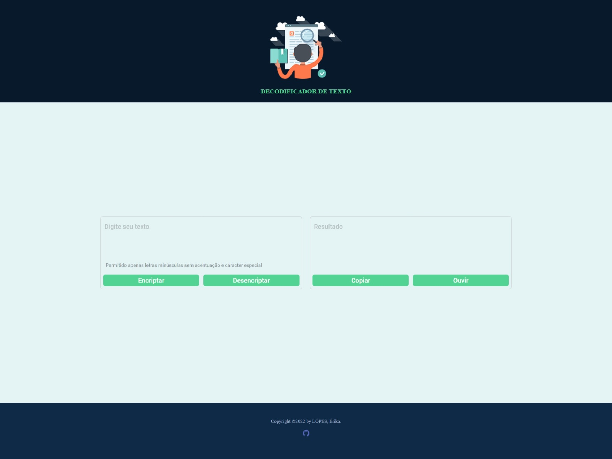

## Challenge Oracle Next Generation: Decodificador de Texto

Projeto base do Decodificador de Textos, uma aplicação conversora de cadeias para decodificar strings.

### Grau I
---

     

#### Página do Challenge [Sprint 01: Construa um decodificador de texto com Javascript!](https://www.alura.com.br/challenges/oracle-one/sprint01-construa-decodificador-texto-com-javascript) 📃

### Funcionalidades:
---

1. Encriptar
2. Desencriptar
3. Copiar
4. Ouvir

### Chaves:
---

`A letra "e" é convertida para "enter"`   
`A letra "i" é convertida para "imes"`   
`A letra "a" é convertida para "ai"`   
`A letra "o" é convertida para "ober"`   
`A letra "u" é convertida para "ufat"`   

### Metodologia:
---

1. Estrutura: HTML
2. Estilização: CSS
3. Interação: JavaScript

- Manipulação do DOM com o objetivo de capturar textos para decodificação;
- Eventos como onclick que disparam funções para efeitos sonoros, encriptar, desencriptar, copiar e ouvir (API).   
- Na logica implementação de arrays para percorrer strings, com estruturas condicionais e repetição.

### Tecnologias:
---

 
  
  
  

  

### Deploy:
---

  <a href="https://erikacls.github.io/conversor-txt-s01/" taget="_blank">Preview!</a>

### Badge Exclusiva do Desafio 🏆

     

